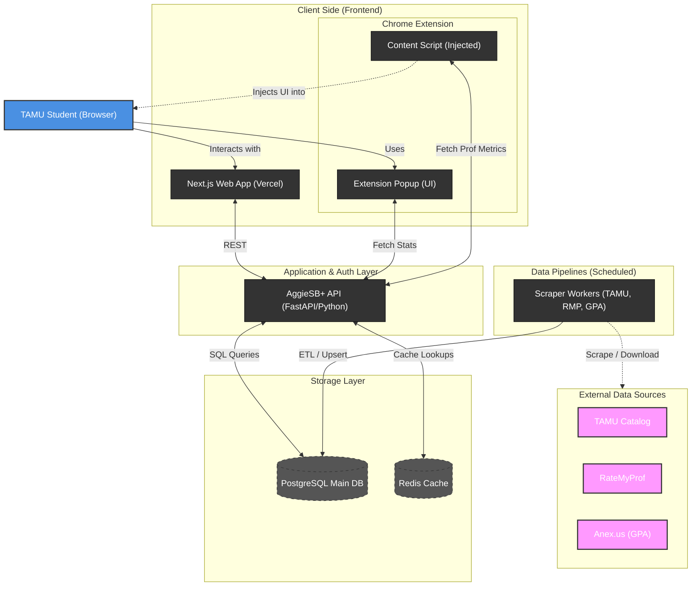

# AggieRMP - Texas A&M University Rate My Professor Analysis

A comprehensive data collection and analysis system for Texas A&M University professor ratings, grade distributions, and course information.

[](https://cronitor.io)
[](https://cronitor.io)
[](https://cronitor.io)

## 🚀 Features

- **Department & Course Scraping** — Automated collection of department and course data from TAMU Course Catalog
- **Rate My Professor Integration** — Collection and analysis of professor ratings and reviews
- **Database Management** — PostgreSQL-based storage with SQLAlchemy ORM
- **Data Analysis** — AI-powered summarization and insights generation
- **API Endpoints** — RESTful API for accessing collected data

## 🏗️ Architecture Flow



## 📁 Project Structure

```
AggieRMP/
├── 📁 src/aggiermp/           # Main source code
│   ├── 📁 api/                # API endpoints and routes
│   ├── 📁 collectors/         # Data collection scripts
│   ├── 📁 database/           # Database models and operations
│   ├── 📁 models/             # Pydantic data models
│   ├── 📁 core/               # Core utilities and configuration
│   └── main.py                # Main application entry point
├── 📁 pipelines/              # Data processing pipelines
│   ├── 📁 professors/         # Professor reviews and summarization
│   ├── 📁 gpa/                # GPA data collection and processing
│   ├── 📁 sections/           # Course section updates
│   └── 📁 courses/            # Course catalog updates
├── 📁 docs/                   # Documentation
├── pyproject.toml             # Project dependencies
└── README.md                  # This file
```

## 🛠️ Installation

1. **Clone the repository**

   ```bash
   git clone <repository-url>
   cd AggieRMP
   ```

2. **Set up virtual environment**

   ```bash
   python -m venv .venv

   # Windows
   .venv\Scripts\activate

   # macOS/Linux
   source .venv/bin/activate
   ```

3. **Install dependencies**

   ```bash
   pip install -e .
   ```

4. **Set up database**
   - Configure your PostgreSQL connection
   - Run database migrations

## 🎯 Usage

### Data Pipelines

1. **Upsert Professor Reviews & Summaries**

   ```bash
   python pipelines/professors/upsert_reviews_and_summaries.py --force-update
   ```

2. **Upsert GPA Data**

   ```bash
   python pipelines/gpa/upsert_gpa_data.py
   ```

### API Server

```bash
python src/aggiermp/main.py
```

## 📊 Data Sources

| Source               | Description                              |
| -------------------- | ---------------------------------------- |
| TAMU Course Catalog  | Department and course information        |
| Anex.us              | Historical GPA data                      |
| Rate My Professor    | Professor ratings and reviews            |
| Manual Curation      | Additional data validation & enhancement |

## 📈 Status

| Pipeline        | Status                                                                                                          |
| --------------- | --------------------------------------------------------------------------------------------------------------- |
| Sections Upsert |        |
| GPA Upsert      |             |
| Courses Upsert  |         |

## 📝 Contributing

1. Fork the repository
2. Create a feature branch
3. Make your changes
4. Add tests
5. Submit a pull request

## 📄 License

This project is for educational and research purposes.

## 🙋‍♂️ Support

For questions or issues, please open a GitHub issue or contact the maintainer.
